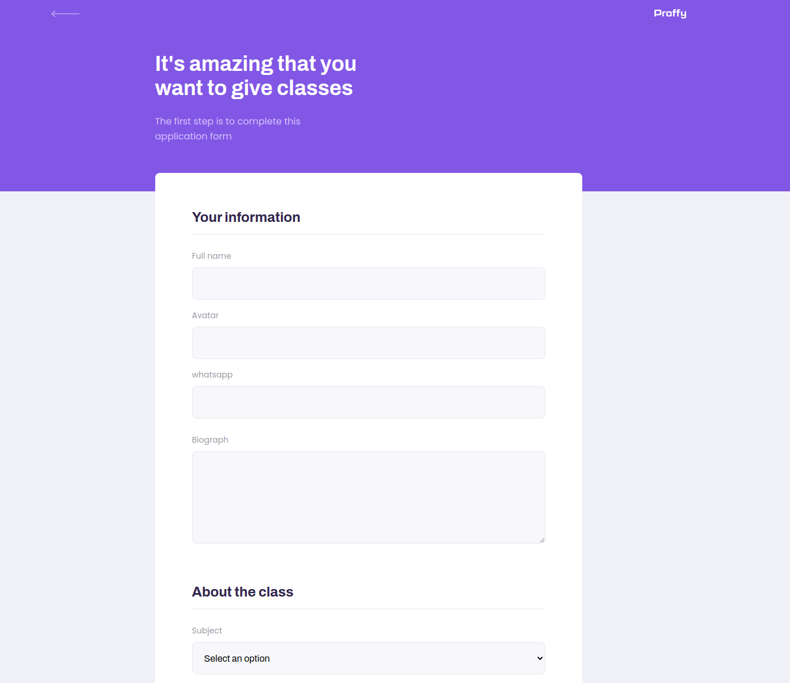

<h1 align="center">
  
</h1>


<p align="center">
  <a href="#-technologies">Technologies</a>&nbsp;&nbsp;&nbsp;|&nbsp;&nbsp;&nbsp;
  <a href="#-project">Project</a>&nbsp;&nbsp;&nbsp;|&nbsp;&nbsp;&nbsp;
  <a href="#-setup">Setup</a>&nbsp;&nbsp;&nbsp;|&nbsp;&nbsp;&nbsp;
  <a href="#-license">License</a>
</p>

<p align="center"> 
  
</p>


## 🚀 The Application

<h1 align="center">
  
    
</h1>

## 🛠 Technologies

This project was developed using the following technologies:

- [React](https://pt-br.reactjs.org/)
- [TypeScript](https://www.typescriptlang.org/)
- [Node](https://nodejs.org/en/)

## 💻 Project


## ✨ Setup

```bash
# Clone the repository
$ git clone https://github.com/wellingtondsf/proffy

# Go to the project folder
$ cd proffy

# Install the web dependencies
$ cd web
$ yarn install
$ cd ..

# Install the server dependencies
$ cd server
$ yarn install
$ cd ..

# Start the application
# The application will start on the port 3000
# In two different consoles, open the web in one and the server in another

# In the server console
$ yarn knex:migrate
$ yarn start

# In the web console
$ yarn start
```

## 📜 License

This project is licensed under the terms of the MIT license. See the file [LICENSE](LICENSE) for more information.
